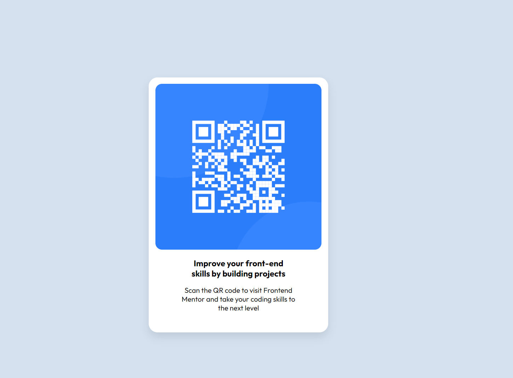

# Frontend Mentor - QR code component solution

This is a solution to the [QR code component challenge on Frontend Mentor](https://www.frontendmentor.io/challenges/qr-code-component-iux_sIO_H). Frontend Mentor challenges help you improve your coding skills by building realistic projects. 

## Table of contents

  - [Screenshot](#screenshot)
  - [Links](#links)
  - [Built with](#built-with)
- [Author](#author)

## Overview

### Screenshot

- Desktop preview

-Mobile preview

### Links

- [Github Project Repo](https://github.com/sawepeter/QrCodeComponent)
-  [Live Site URL](https://qr-code-component-ruddy-seven.vercel.app/)

### Built with 

I used HTMl and CSS.

## Author

- Website - [Portifolio](https://sawepeter.github.io/)
- Frontend Mentor - [sawepeter](https://www.frontendmentor.io/profile/sawepeter)
- Twitter - [sawepeter](https://twitter.com/SawePeter3)

